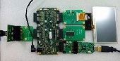

.. _Marker_Detection_Demo_Quickstart:

Marker Detection Demo Quickstart Guide
======================================

In this demonstration we use the following hardware and software:
  * XP-SKC-L16 sliceKIT 
  * XA-SK-SDRAM Slice Card,
  * XA-SK-IMAGE SENSOR Slice Card,
  * XA-SK-SCR480 Slice Card with LCD,
  * module_sdram,
  * module_slicekit_support,
  * module_image_sensor
  * module_i2c_master,
  * module_object_localization
  * module_xassert

together to create a real-time detection of marker placed on a rectangular grid illuminated uniformly. It demonstrates a pipeline of 
typical processing steps common in low cost embedded machine vision and some computer vision applications 
including "Otsu's" thresholding method, morphological operations and connected component analysis. 
The (x,y) coordinates of the marker's location are displayed on the console. 

Hardware Setup
++++++++++++++

The XP-SKC-L16 sliceKIT Core board has four slots with edge connectors: ``SQUARE``, ``CIRCLE``, ``TRIANGLE`` 
and ``STAR``. 

To setup up the system:

   #. Connect XA-SK-SDRAM Slice Card to the ``STAR`` slot of XP-SKC-L16 sliceKIT Core board.
   #. Connect XA-SK-IMAGE SENSOR Slice Card to the ``CIRCLE`` slot.
   #. Connect XA-SK-SCR480 Slice Card with LCD to the ``TRIANGLE`` slot.
   #. Connect the xTAG Adapter to sliceKIT Core board, and connect xTAG-2 to the adapter. 
   #. Connect the xTAG-2 to host PC. Note that the USB cable is not provided with the sliceKIT starter kit.
   #. Set the ``XMOS LINK`` to ``OFF`` on the xTAG Adapter(XA-SK-XTAG2).
   #. Switch on the power supply to the sliceKIT Core board.
   #. Print the rectangular grid in the file ``rect_grid.png``. Place it vertically in front of the camera. Also, stick a small bright colored marker of any shape inside the rectangular grid.
   

   Hardware Setup for Marker Detection Demo
   
   
	
Import and Build the Application
++++++++++++++++++++++++++++++++

   #. Open xTIMEcomposer and check that it is operating in online mode. Open the edit perspective (Window->Open Perspective->XMOS Edit).
   #. Locate the ``'Marker Detection Demo'`` item in the xSOFTip pane on the bottom left of the window and drag it into the Project Explorer window in the xTIMEcomposer. This will also cause the modules on which this application depends to be imported as well. 
   #. Click on the ``app_marker_detection`` item in the Explorer pane then click on the build icon (hammer) in xTIMEcomposer. Check the console window to verify that the application has built successfully.
   #. There will be quite a number of warnings that ``bidirectional buffered port not supported in hardware``. These can be safely ignored for this component.

For help in using xTIMEcomposer, try the xTIMEcomposer tutorial, which you can find by selecting Help->Tutorials from the xTIMEcomposer menu.

Note that the Developer Column in the xTIMEcomposer on the right hand side of your screen provides information on the xSOFTip components you are using. Select the module_display_controller component in the Project Explorer, and you will see its description together with API documentation. Having done this, click the `back` icon until you return to this quickstart guide within the Developer Column.

Run the Application
+++++++++++++++++++

Now that the application has been compiled, the next step is to run it on the sliceKIT Core Board using the tools to load the application over JTAG (via the xTAG-2 and xTAG Adapter card) into the xCORE multicore microcontroller.

   #. First,  run the application ``Display Video``.
   #. Adjust the position of the rectangular grid in order to bring the rectangle within the view of image sensor. The grid surrounded by only the dark background should be seen on the LCD. 
   #. Select the file ``app_marker_detection`` project from the Project Explorer.
   #. Click on the ``Run`` icon (the white arrow in the green circle). 
   #. At the ``Select Device`` dialog select ``XMOS xTAG-2 connect to L1[0..1]`` and click ``OK``.
   #. The (x,y) coordinates of the location of the marker are displayed on the console. For example, if the marker is placed at the center of the grid, the app reports ``Marker located at (0.0 cm, 0.0 cm)``.

Next Steps
++++++++++

 #. Try changing the location of the marker in run-time. The new coordinates will be reported. Any intermediate reporting while changing the location should be ignored.