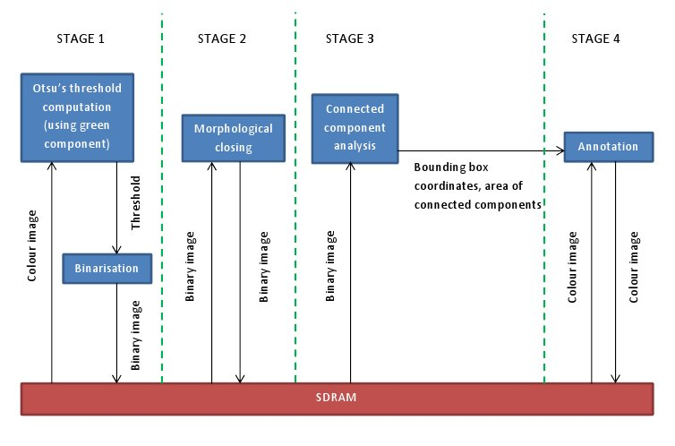
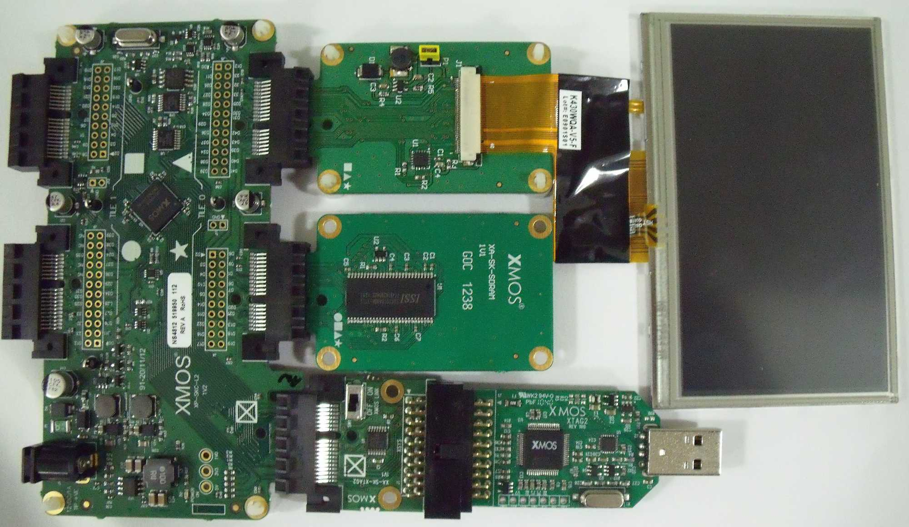

.. _Object_Localisation_Quickstart:

Object Localisation Demo Quickstart Guide
=========================================

This demonstration uses the sliceKIT hardware and software listed below together to locate objects (blobs) on still colour or gray images and create an interactive display of processed images on the LCD. It demonstrates a pipeline (shown in the figure) of typical processing steps common in machine vision and some computer vision applications including "Otsu's" thresholding method, morphological operations and connected component analysis. The results are dislayed interactively on the LCD.

  * XA-SK-SCR480 Slice Card
  * XA-SK-SDRAM Slice Card
  * Machine Vision Pipeline Components
  * SDRAM Memory Controller
  * Parallel RGB LCD Driver
  * Touch Screen Driver Function Library

   Pipelined Stages for Object Localisation
   

Hardware Setup
++++++++++++++

The XP-SKC-L2 Slicekit Core board has four slots with edge connectors: ``SQUARE``, ``CIRCLE``, ``TRIANGLE`` and ``STAR``. 

To setup up the system:

   #. Connect XA-SK-SDRAM Slice Card to the XP-SKC-L2 Slicekit Core board using the connector marked with the ``STAR``.
   #. Connect XA-SK-SCR480 Slice Card to the XP-SKC-L2 Slicekit Core board using the connector marked with the ``TRIANGLE``.
   #. Connect the XTAG Adapter to Slicekit Core board, and connect XTAG-2 to the adapter. 
   #. Connect the XTAG-2 to host PC. Note that the USB cable is not provided with the Slicekit starter kit.
   #. Set the ``XMOS LINK`` to ``OFF`` on the XTAG Adapter(XA-SK-XTAG2).
   #. Ensure the jumper on the XA-SK-SCR480 is bridged if the back light is required.
   #. Switch on the power supply to the Slicekit Core board.

   Hardware Setup for Object Localisation Demo
   
	
Import and Build the Application
++++++++++++++++++++++++++++++++

   #. Open xTIMEcomposer and check that it is operating in online mode. Open the edit perspective (Window->Open Perspective->XMOS Edit).
   #. Locate the ``'Object Localisation Demo'`` item in the xSOFTip pane on the bottom left of the window and drag it into the Project Explorer window in the xTIMEcomposer. This will also cause the modules on which this application depends to be imported as well. 
   #. Click on the app_object_localisation item in the Explorer pane then click on the build icon (hammer) in xTIMEcomposer. Check the console window to verify that the application has built successfully.
   #. There will be quite a number of warnings that ``bidirectional buffered port not supported in hardware``. These can be safely ignored for this component.

For help in using xTIMEcomposer, try the xTIMEcomposer tutorial, which you can find by selecting Help->Tutorials from the xTIMEcomposer menu.

Note that the Developer Column in the xTIMEcomposer on the right hand side of your screen provides information on the xSOFTip components you are using. Select the module_display_controller component in the Project Explorer, and you will see its description together with API documentation. Having done this, click the `back` icon until you return to this quickstart guide within the Developer Column.

Run the Application
+++++++++++++++++++

Now that the application has been compiled, the next step is to run it on the Slicekit Core Board using the tools to load the application over JTAG (via the XTAG2 and Xtag Adapter card) into the xCORE multicore microcontroller.

   #. Select the file ``app_object_localisation.xc`` in the ``app_object_localisation`` project from the Project Explorer.
   #. Click on the ``Run`` icon (the white arrow in the green circle). 
   #. At the ``Select Device`` dialog select ``XMOS XTAG-2 connect to L1[0..1]`` and click ``OK``.
   #. Wait until the images have loaded over the XTAG connector from the host. This may take 30 seconds or so, since they are being loaded over the serial JTAG connection via the XTAG2. There is a series of five images to be processed for object localisation.
   #. Once the first processed image is displayed, a message is displayed on the console to prompt the user to touch the LCD screen for displaying the remaining processed images one after another.
   #. The objects in the images are shown by green boxes.
   #. The next image is the binary image of the first image after morphological closing. The subsequent images displayed are the processed images of remaining four images.
   #. Finally note that this application calculates the time taken to process each of the images, and then calculates the resulting effective frame rate.

Next Steps
++++++++++

 #. Try changing the files that are loaded from the host. To do this, generate an image (should have bright objects on a dark background and vice versa), save it in ``tga`` format uncompressed. Save the file(s) into ``images`` folder of ``app_object_localisation`` directory within your workspace. Now, change the ``IMAGE_COUNT`` and add the name of your new image to the array ``images`` defined in ``app_conf.h``. Ensure the filename is less than 30 characters long.
 #. If the images contains dark objects on a bright background, the define ``OBJECT_LOCALISATION_BRIGHT_OBJ_DARK_BG`` in ``binarisation_conf.h`` should be assigned the value 0. 
 #. The colour of bounding boxes on objects can be changed from green by redefining ``BOX_COLOUR``. 
 #. ``SIZE_THRESHOLD`` in ``app_conf.h`` controls the size in pixels of spurious objects to be ignored. 
 #. Assign 0 to ``OBJECT_LOCALISATION_NUM_DILATE`` and ``OBJECT_LOCALISATION_NUM_ERODE`` in ``morph_conf.h`` to check the binary image resulting from binarisation and before applying morphological closing.

    
